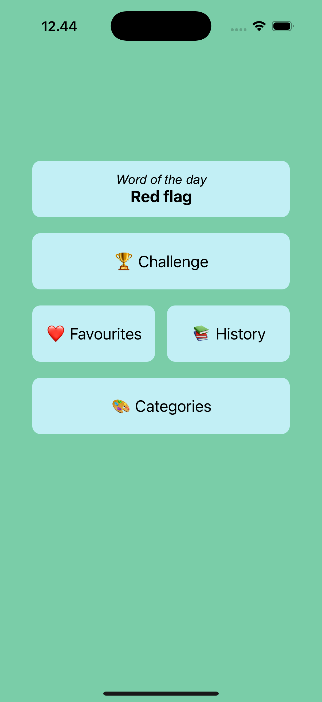
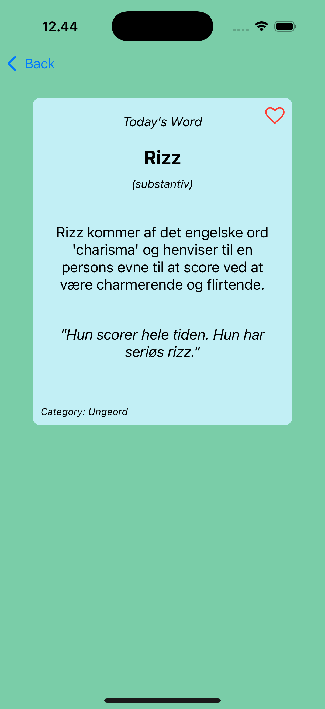
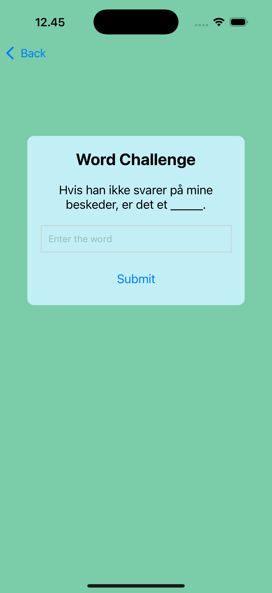
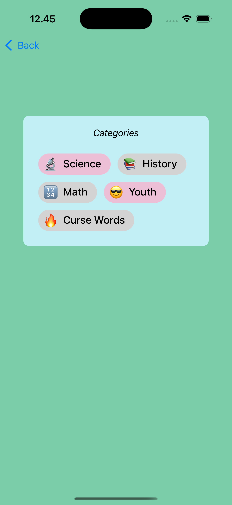

# Word of the Day App

The **Word of the Day** app is a React Native application designed to enhance gen-z vocabulary in a fun way. It provides users with a daily word, allows them to explore word history, favorite words, participate in challenges, and manage categories of interest.

## Features

- **Daily Word**: Displays a new word every day with its definition, example sentence, and category.
- **Word History**: View a list of previously displayed words.
- **Favorites**: Mark words as favorites and access them in a dedicated screen.
- **Word Challenge**: Test your knowledge by guessing the missing word in a sentence.
- **Categories**: Select and manage categories of interest to personalize your experience.
- **Local Storage**: Persist user preferences, word history, and favorites using AsyncStorage.

## Tools and Tech Stack

- **React Native**: Framework for building cross-platform mobile applications.
- **Expo Router**: Simplified navigation and routing for React Native apps.
- **Redux**: State management for handling global app state.
- **AsyncStorage**: Local storage for persisting data.
- **React Native Paper**: UI components for a polished and consistent design.
- **TypeScript**: Strongly typed programming language for better code quality.
- **Safe Area Context**: Ensures proper layout within safe areas on devices.

## Screens Overview

1. **Word of the Day**: Displays the daily word or a selected word from history or favorites.
2. **History**: Lists all previously displayed words.
3. **Favorites**: Shows words marked as favorites.
4. **Challenge**: Provides a word guessing game based on example sentences.
5. **Categories**: Allows users to select and manage word categories.

## Screenshots

Here are some screenshots of the app:

| Home                                                | Word of the Day                          |
| --------------------------------------------------- | ---------------------------------------- |
|  |  |

| Challenges                                  | Categories                                  |
| ------------------------------------------- | ------------------------------------------- |
|  |  |
